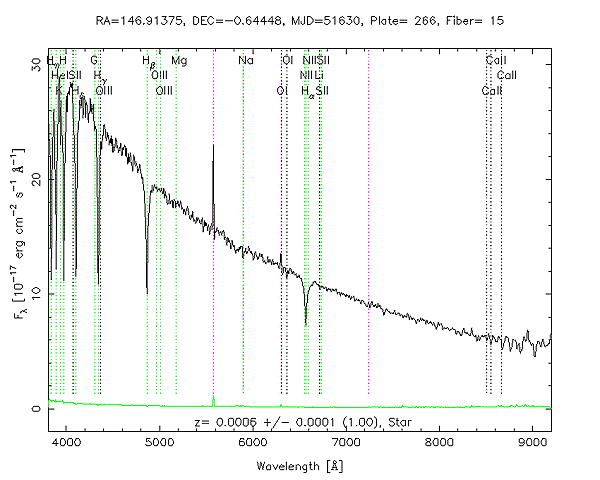

# Stellar Classification

In this notebook, you will learn how to download spectrum data from sdss survey, load fits file, and build a deep learning model for classifying stars

Full credit of the theoretical material and the write-up in the notebook goes to [SDSS Skyserver](<http://skyserver.sdss.org/dr1/en/proj/advanced/spectraltypes/default.asp>)
